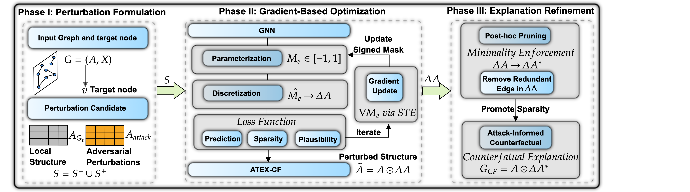

# ATEX-CF: Attack-Informed Counterfactual Explanations for Graph Neural Networks

<p align="center">
  
</p>

---

## Overview  

ATEX-CF is a novel framework that unifies adversarial attack strategies with counterfactual explanation generation for Graph Neural Networks. By integrating both edge additions and deletions within a constrained budget, it produces minimal, plausible, and highly effective explanations that outperform deletion-only and attack-only baselines across multiple benchmarks.

This repository provides the implementation of ATEX-CF, including scripts for model training, explanation generation, and evaluation, to facilitate reproducibility and further research.  

---

## Abstract  

Counterfactual explanations offer an intuitive way to interpret graph neural networks (GNNs) by identifying minimal changes that alter a model’s prediction, thereby answering “what must differ for a different outcome?”. 

In this work, we propose a novel framework, ATEX-CF that unifies adversarial attack techniques with counterfactual explanation generation—a connection made feasible by their shared goal of flipping a node’s prediction, yet differing in perturbation strategy: adversarial attacks often rely on edge additions, while counterfactual methods typically use deletions.

Unlike traditional approaches that treat explanation and attack separately, our method efficiently integrates both edge additions and deletions, grounded in theory, leveraging adversarial insights to explore impactful counterfactuals.

In addition, by jointly optimizing fidelity, sparsity, and plausibility under a constrained perturbation budget, our method produces instance-level explanations that are both informative and realistic.
Experiments on synthetic and real-world node classification benchmarks demonstrate that ATEX-CF generates faithful, concise, and plausible explanations, highlighting the effectiveness of integrating adversarial insights into counterfactual reasoning for GNNs.

---

## Dataset  

We evaluate ATEX-CF on both synthetic and real-world benchmarks.

Synthetic datasets include BA-SHAPES and TREE-CYCLES, widely used in GNN explainability, and the Loan-Decision social graph. 

For real-world evaluation, we use the Cora citation network and the large-scale ogbn-arxiv dataset from OGB.

---


## Installation  

### Prerequisites  
- Python 3.10+  
- Libraries listed in `requirements.txt`  

### Steps  

1. Install PyTorch  
```bash
pip install torch==2.2.2
pip install torch-scatter torch-sparse torch-geometric -f https://pytorch-geometric.com/whl/torch-2.2.2+cpu.html
pip install torchvision==0.17.2
```

2. Install PyTorch Geometric
```bash
pip install torch-geometric==2.6.1
```

2. install deeprobust
```bash
pip install deeprobust==0.2.11
```

### Usage

1. Generate counterfactual and factual explanations (ATEX-CF, CF-GNNExplainer, GNNExplainer, PGExplainer) [counterfactual_explanation_subgraph](counterfactual_explanation_subgraph)
2. Generate adversarial attack subgraph (Nettack, GOttack) [evasion_attack_subgraph](evasion_attack_subgraph)
3. Model train: [gnn_model_train.py](gnn_model_train.py), [gcn_arxiv_batch.py](gcn_arxiv_batch.py)
4. GNN analysis: [gnn_graph_generate.py](gnn_graph_generate.py), [gnn_graph_analysis.py](gnn_graph_analysis.py)
5. Explanations evaluation: [evaluator_ac_gnnexplainer.py](evaluator_ac_gnnexplainer.py), [evaluator_cf_gnnexplainer.py](evaluator_cf_gnnexplainer.py), [evaluator_cf_gnnexplainer_budget.py](evaluator_cf_gnnexplainer_budget.py), [evaluator_gnnexplainer.py](evaluator_gnnexplainer.py), [evaluator_pgexplainer.py](evaluator_pgexplainer.py), [evaluator_Nettack.py](evaluator_Nettack.py), [evaluator_GOttack.py](evaluator_GOttack.py)
6. Parameters setting: [config](config)