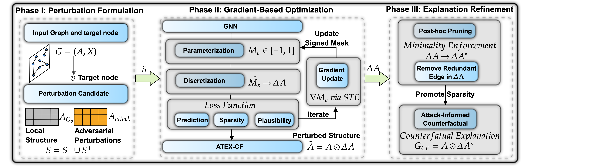

# ATEX-CF: Attack-Informed Counterfactual Explanations for Graph Neural Networks

<p align="center">
  
</p>

---

## Overview

**Paper Title:** ATEX-CF: Attack-Informed Counterfactual Explanations for Graph Neural Networks

**Authors:** Yu Zhang, Sean Bin Yang, Arijit Khan, Cuneyt Gurcan Akcora

**Published in:** ICLR 2026 (International Conference on Learning Representations)

**Citation:**  
If you use this work, please cite it as:

```bibtex
@inproceedings{zhang2026atex,
  title={ATEX-CF: Attack-Informed Counterfactual Explanations for Graph Neural Networks},
  author={Yu Zhang and Sean Bin Yang and Arijit Khan and Cuneyt Gurcan Akcora},
  booktitle={International Conference on Learning Representations (ICLR)},
  year={2026}
}
```
**ArXiv:** [https://doi.org/10.48550/arXiv.2602.06240](https://doi.org/10.48550/arXiv.2602.06240)

ATEX-CF is a novel framework that unifies adversarial attack strategies with counterfactual explanation generation for Graph Neural Networks. By integrating both edge additions and deletions within a constrained budget, it produces minimal, plausible, and highly effective explanations that outperform deletion-only and attack-only baselines across multiple benchmarks.

This repository provides the implementation of ATEX-CF, including scripts for model training, explanation generation, and evaluation, to facilitate reproducibility and further research.  

---

## Abstract  

Counterfactual explanations offer an intuitive way to interpret graph neural networks (GNNs) by identifying minimal changes that alter a model’s prediction, thereby answering “what must differ for a different outcome?”. 

In this work, we propose a novel framework, ATEX-CF that unifies adversarial attack techniques with counterfactual explanation generation—a connection made feasible by their shared goal of flipping a node’s prediction, yet differing in perturbation strategy: adversarial attacks often rely on edge additions, while counterfactual methods typically use deletions.

Unlike traditional approaches that treat explanation and attack separately, our method efficiently integrates both edge additions and deletions, grounded in theory, leveraging adversarial insights to explore impactful counterfactuals.

In addition, by jointly optimizing fidelity, sparsity, and plausibility under a constrained perturbation budget, our method produces instance-level explanations that are both informative and realistic.
Experiments on synthetic and real-world node classification benchmarks demonstrate that ATEX-CF generates faithful, concise, and plausible explanations, highlighting the effectiveness of integrating adversarial insights into counterfactual reasoning for GNNs.

---

## Dataset  

We evaluate ATEX-CF on both synthetic and real-world benchmarks.

Synthetic datasets include BA-SHAPES and TREE-CYCLES, widely used in GNN explainability, and the Loan-Decision social graph. 

For real-world evaluation, we use the Cora citation network, the large-scale ogbn-arxiv dataset from OGB, and include the heterophilic Chameleon dataset, which is known for its low feature homophily and non-community structure, providing a challenging real-world setting for counterfactual explanations..

---


## Installation

### Prerequisites  
- Python 3.10+  
- Libraries listed in `requirements.txt`  

### Steps  

1. Install PyTorch  (cpu version)
```bash
pip install torch==2.2.2
pip install torch-scatter torch-sparse torch-geometric -f https://pytorch-geometric.com/whl/torch-2.2.2+cpu.html
pip install torchvision==0.17.2
```

2. Install PyTorch Geometric
```bash
pip install torch-geometric==2.6.1
```

2. install deeprobust
```bash
pip install deeprobust==0.2.11
```

### Usage

1. Model train: [gnn_model_train.py](gnn_model_train.py), [gcn_arxiv_batch.py](gcn_arxiv_batch.py)
2. Generate counterfactual explanations [acexplainer_subgraph.py](acexplainer_subgraph.py)
3. Explanations evaluation: [evaluator_ac_gnnexplainer.py](evaluator_ac_gnnexplainer.py)
4. Parameters setting: [config.py](config%2Fconfig.py)

Current branch is the simplest branch about ATEX-CF method. Please checkout branch **master** for more implementations about compared methods (CF-GNNExplainer, INDUCE, C2Explainer, CFF, NSEG, GNNExplainer, PGExplainer, Nettack, GOttack)

## lite-package

**⚠️ Note:** This is a **lite/pip-installable version** of ATEX-CF.  
The package is **under development** and not yet fully released.

1. Install pip package  (cpu version) -- coming soon
```bash
pip install atex_cf
```
